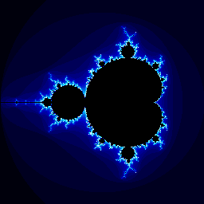
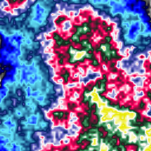
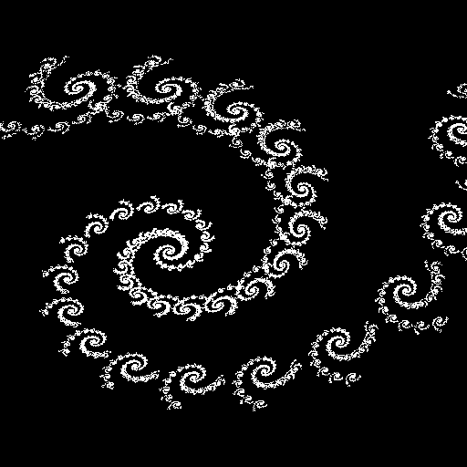

# Fractals

Various snippets of fractal rendering code

## List of subprojects

### 3D fractals

### Strange attractors

### Fractals in complex plane

### Procedural texture generators

### Iterated Functions Systems (IFS)

### L-systems

### Interactive fractal viewers

### Other code snippets
