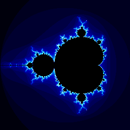
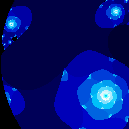

# Fractals in complex plane

## [Classic Mandelbrot fractal](mandelbrot.md)

## [Classic Julia fractal](julia.md)

## [Lambda fractal](lambda.md)

## [Manowar fractal](manowar.md)

## [Barnsley's fractals](barnsley.md)

## [Phoenix fractal](phoenix.md)

## [Magnet fractal](magnet.md)

## [Newton fractal](newton.md)

# Source codes

